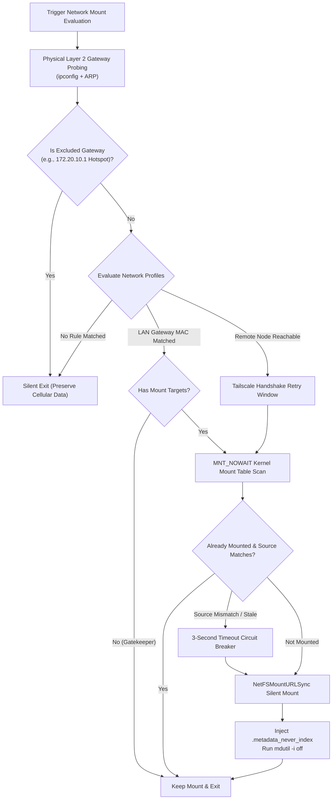
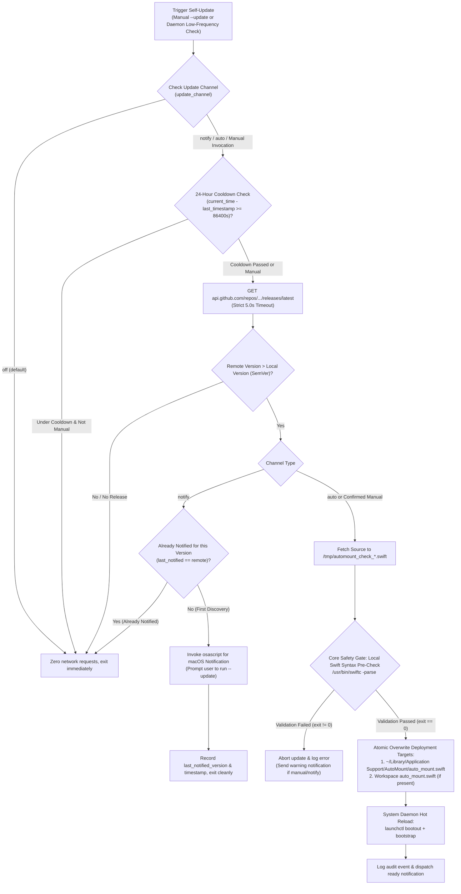
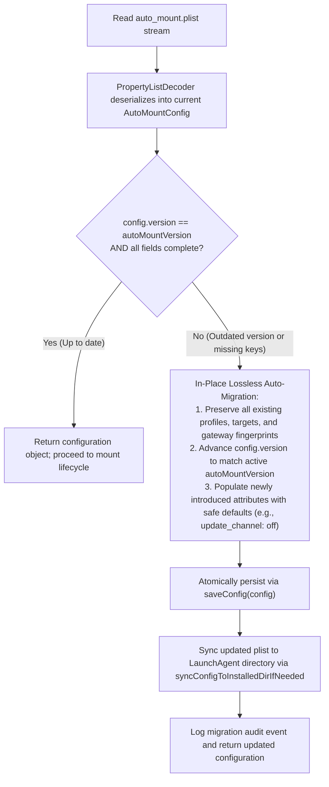

# Core Architecture and Decision Model

When mounting network storage volumes in macOS automation workflows, high-level blocking APIs and permission barriers must be avoided by following a deterministic technical path:



## Network Exclusion Gatekeeper Mechanism

* **Zero-Target Profile Truncation**: When a higher-priority network profile (such as `local_lan`) configures its `targets` array as empty `[]`, it functions as an exclusion gatekeeper.
* **Deterministic Route Interception**: When the physical gateway MAC matches this profile, the engine finishes processing 0 mount actions and immediately truncates the evaluation chain. This cleanly prevents lower-priority remote profiles (e.g., Tailscale) from triggering while physically located in that network. Once the device leaves the physical network, the MAC fingerprint mismatches and evaluation gracefully falls back to the remote policy.

## Mount API Selection

* **Avoid `mount_smbfs`**: This command cannot directly read credentials from the macOS Keychain. It mandates plaintext passwords in configuration files or interactive terminal input, and triggers permission alerts on newer macOS versions.
* **Mandate `NetFSMountURLSync`**: A system-level C interface from the NetFS framework. Passing `nil` for username and password automatically invokes Keychain authentication silently without Finder window popups or interactive prompts.

## Network Topology Probing Selection

* **Limitations of High-Level Wi-Fi APIs**: Starting with macOS 14, CoreWLAN access to SSID strings is strictly permission-gated. Furthermore, when global VPNs (e.g., TUN virtual interfaces) are active, default routes are redirected, causing high-level network state checks to report false connection states.
* **Physical Layer 2 ARP Gateway Fingerprinting**: By querying physical interfaces (`en0`, etc.) for their DHCP router IP and reading the Layer 2 ARP table, the physical router's hardware MAC address can be determined. This mechanism bypasses TUN tunnels, accurately reflects the physical environment, and requires no root (`sudo`) privileges.


# Production-Grade Core Code Patterns (Swift)

## Keychain-Integrated Silent Mount Pattern

Mount remote SMB shares cleanly without prompting user dialogs or opening Finder windows:

```swift
import Foundation
import NetFS

func mountSMBVolumeSilently(urlString: String) -> Bool {
    guard let url = CFURLCreateWithString(kCFAllocatorDefault, urlString as CFString, nil) else {
        return false
    }
    
    var mountPoints: Unmanaged<CFArray>?
    // Passing nil for user and password triggers system Keychain authentication
    let status = NetFSMountURLSync(
        url,
        nil,
        nil,
        nil,
        nil,
        nil,
        &mountPoints
    )
    
    if let points = mountPoints {
        points.release()
    }
    
    return status == noErr
}
```

## Non-Blocking Kernel Mount Table Inspection

Never use `FileManager.default.fileExists` or POSIX `stat()` on network volume paths that might be unreachable; doing so blocks the calling thread in kernel sleep and causes system spinning beachball hangs. Use `getfsstat` with the `MNT_NOWAIT` flag instead:

```swift
import Darwin

struct ActiveMountRecord {
    let mountPath: String
    let sourceURL: String
}

func queryActiveKernelMounts() -> [ActiveMountRecord] {
    let count = getfsstat(nil, 0, MNT_NOWAIT)
    guard count > 0 else { return [] }
    
    var buffer = [statfs](repeating: statfs(), count: Int(count))
    let actualCount = buffer.withUnsafeMutableBufferPointer { ptr in
        getfsstat(ptr.baseAddress, count * Int32(MemoryLayout<statfs>.size), MNT_NOWAIT)
    }
    
    var results: [ActiveMountRecord] = []
    for i in 0..<Int(actualCount) {
        let entry = buffer[i]
        let path = withUnsafePointer(to: entry.f_mntonname) {
            $0.withMemoryRebound(to: CChar.self, capacity: Int(MAXPATHLEN)) { String(cString: $0) }
        }
        let source = withUnsafePointer(to: entry.f_mntfromname) {
            $0.withMemoryRebound(to: CChar.self, capacity: Int(MAXPATHLEN)) { String(cString: $0) }
        }
        results.append(ActiveMountRecord(mountPath: path, sourceURL: source))
    }
    return results
}
```

## Timeout Circuit Breaker and Forced Cleanup

When a network change leaves existing mounts unresponsive, enforce a strict 3-second timeout circuit breaker using a two-stage unmount strategy:

```swift
import Foundation
import Darwin

func forceUnmountStaleVolume(at mountPath: String, timeout: Double = 3.0) -> Bool {
    let group = DispatchGroup()
    var success = false
    
    group.enter()
    DispatchQueue.global(qos: .userInitiated).async {
        // Stage 1: Graceful forced unmount via diskutil
        let task = Process()
        task.executableURL = URL(fileURLWithPath: "/usr/sbin/diskutil")
        task.arguments = ["unmount", "force", mountPath]
        try? task.run()
        task.waitUntilExit()
        
        if task.terminationStatus == 0 {
            success = true
        } else {
            // Stage 2: Low-level POSIX MNT_FORCE unmount
            success = (unmount(mountPath, MNT_FORCE) == 0)
        }
        group.leave()
    }
    
    let result = group.wait(timeout: .now() + timeout)
    return result == .success && success
}
```

## Spotlight Search and Cellular Hotspot Protection

Immediately disable metadata indexing upon mounting to prevent background indexing from saturating remote storage connections and consuming excessive CPU:

```swift
import Foundation

func protectVolumeFromSpotlight(mountPath: String) {
    let flagFile = (mountPath as NSString).appendingPathComponent(".metadata_never_index")
    if !FileManager.default.fileExists(atPath: flagFile) {
        FileManager.default.createFile(atPath: flagFile, contents: nil)
    }
    
    let task = Process()
    task.executableURL = URL(fileURLWithPath: "/usr/bin/mdutil")
    task.arguments = ["-i", "off", mountPath]
    try? task.run()
    task.waitUntilExit()
}
```

## Physical Network Topology and ARP Hardware Extraction

Bypass virtual TUN interfaces and extract physical router identifiers directly from Layer 2:

```swift
import Foundation
import SystemConfiguration

func getPhysicalGatewayIP() -> (ip: String, interface: String)? {
    guard let interfaces = SCNetworkInterfaceCopyAll() as? [SCNetworkInterface] else { return nil }
    for iface in interfaces {
        guard let name = SCNetworkInterfaceGetBSDName(iface) as String?, name.starts(with: "en") else { continue }
        let task = Process()
        task.executableURL = URL(fileURLWithPath: "/usr/sbin/ipconfig")
        task.arguments = ["getoption", name, "router"]
        let pipe = Pipe()
        task.standardOutput = pipe
        try? task.run()
        task.waitUntilExit()
        let data = pipe.fileHandleForReading.readDataToEndOfFile()
        if let ip = String(data: data, encoding: .utf8)?.trimmingCharacters(in: .whitespacesAndNewlines), !ip.isEmpty {
            return (ip, name)
        }
    }
    return nil
}

func getGatewayMAC(for ip: String) -> String? {
    let task = Process()
    task.executableURL = URL(fileURLWithPath: "/usr/sbin/arp")
    task.arguments = ["-n", ip]
    let pipe = Pipe()
    task.standardOutput = pipe
    try? task.run()
    task.waitUntilExit()
    let data = pipe.fileHandleForReading.readDataToEndOfFile()
    guard let output = String(data: data, encoding: .utf8) else { return nil }
    
    let pattern = "([0-9a-fA-F]{1,2}(?::[0-9a-fA-F]{1,2}){5})"
    guard let regex = try? NSRegularExpression(pattern: pattern),
          let match = regex.firstMatch(in: output, range: NSRange(output.startIndex..., in: output)),
          let range = Range(match.range(at: 1), in: output) else {
        return nil
    }
    return String(output[range]).lowercased()
}
```


# System-Level Automation Standards (LaunchAgent)

Unlike polling-based scripts, macOS-native automation subscribes to network preference changes via launchd `WatchPaths`, achieving zero background memory overhead and sub-second event-driven triggers.

## Service Definition Standard (`~/Library/LaunchAgents/com.user.auto-mount.plist`)

```xml
<?xml version="1.0" encoding="UTF-8"?>
<!DOCTYPE plist PUBLIC "-//Apple//DTD PLIST 1.0//EN" "http://www.apple.com/DTDs/PropertyList-1.0.dtd">
<plist version="1.0">
<dict>
    <key>Label</key>
    <string>com.user.auto-mount</string>
    <key>ProgramArguments</key>
    <array>
        <string>/Users/USERNAME/Library/Application Support/AutoMount/auto_mount</string>
    </array>
    <key>WatchPaths</key>
    <array>
        <string>/Library/Preferences/SystemConfiguration</string>
    </array>
    <key>RunAtLoad</key>
    <true/>
    <key>StandardOutPath</key>
    <string>/tmp/com.user.auto-mount.stdout.log</string>
    <key>StandardErrorPath</key>
    <string>/tmp/com.user.auto-mount.stderr.log</string>
</dict>
</plist>
```

## Modern Registration and Lifecycle Management

On macOS 13+, macOS 26+, and macOS 27+, use modern `bootstrap` and `bootout` commands rather than legacy `launchctl load` / `unload`:

```bash
# Obtain current GUI user UID
UID=$(id -u)

# Unload previous service instance if present
launchctl bootout "gui/${UID}/com.user.auto-mount" 2>/dev/null || true

# Register and load service
launchctl bootstrap "gui/${UID}" ~/Library/LaunchAgents/com.user.auto-mount.plist

# Verify current service status
launchctl list | grep com.user.auto-mount
```


# Troubleshooting and Edge Case Runbook

## Remote WireGuard / Tailscale Handshake Latency

* **Symptom**: Immediately after connecting to an external network with Tailscale active, the initial mount attempt occasionally times out.
* **Root Cause**: WireGuard tunnel establishment requires a brief negotiation window (tens to hundreds of milliseconds).
* **Mitigation**: Introduce a retry window during host probing (e.g., 3 retries at 1.0-second intervals) to verify tunnel readiness before initiating NetFS calls.

## Local Area Network mDNS Resolution Instability

* **Symptom**: `smb://server.local/share` occasionally fails to resolve, even though the server is online.
* **Diagnostic Procedure**:
  ```bash
  # 1. Verify service advertisement
  dns-sd -B _smb._tcp local.

  # 2. Bypass mDNS and query direct IP address
  smbutil lookup server
  ```
* **Mitigation**: Configure static hostnames or IP addresses instead of relying solely on mDNS broadcasts, or maintain fallback IP mappings in configuration profiles.

# CLI Control Layer & Interaction Architecture

## Unified Configuration Dashboard & Orthogonal Subcommands

AutoMount CLI merges the classic UNIX orthogonal philosophy with modern interactive console UX:

* **Underlying Orthogonal Commands**: `--install`, `--uninstall`, and `--status` serve as dedicated, non-interactive subcommands designed for automated provisioning, scripts, and CI/CD operations.
* **Aggregated Configuration Center**: `--config` functions as an all-in-one control center displaying the live LaunchAgent status (`gui/<uid>`) while incorporating service deployment, reload, status checks, and uninstallation into a unified menu.
* **Streamlined Initial Setup**: `--init` pairs hardware detection, target selection, remote fallback, update channel policy, and LaunchAgent daemon deployment into a 5-step seamless workflow.
* **Defensive Parameter Validation**: Enforces strict CLI argument validation; unrecognized options are immediately rejected with standard usage instructions, preventing unintended execution of unmount or mount sequences.

## Zero-Dependency Native Localization (i18n)

* **System Language Adaptation**: Inspects `Locale.preferredLanguages` dynamically, defaulting seamlessly to English on non-Chinese systems.
* **Environment Variable Override**: Supports `AUTO_MOUNT_LANG=zh|en` for explicit language specification and testing.
* **Lightweight Embedded Translation Engine**: Dispatches localized strings directly within the standalone Swift file without external `.strings` bundles, preserving portability and zero external dependencies.

# Self-Update & Hot-Reload Engine Architecture

To allow seamless upgrades for both the background daemon and local developer workspaces without risking daemon crashes from network errors or invalid code, AutoMount implements a dual-channel safe self-update lifecycle model:



## 1. 24-Hour Cooldown Window & Debouncing

* **Low-Frequency Principle**: Even when configured with `notify` or `auto`, the background daemon checks `last_update_check_timestamp` whenever awakened by network events. If less than 86,400 seconds (24 hours) have elapsed, the update logic short-circuits in nanoseconds, preventing rapid network transitions (such as toggling Wi-Fi or switching interfaces) from flooding GitHub APIs or triggering rate limits.
* **Mounting Task Priority**: Background update checks always execute after volume mount actions finish, ensuring network storage operations maintain sub-second priority without being impeded by external HTTP latency.

## 2. Single-Notification Anti-Fatigue Mechanism

* **Alert Fatigue Prevention**: For the `notify` channel, AutoMount stores `last_notified_version` in the configuration. Once a system banner has been displayed for a newly released build, this version tag is persisted to disk.
* **Release-Bound Trigger**: Even across network switches after the 24-hour cooldown expires, if the remote release tag remains identical to `last_notified_version`, the notification is suppressed, avoiding repetitive alerts. Only when a newer version is tagged upstream will a new notification be triggered.

## 3. Local `swiftc -parse` Syntax Pre-Check Circuit Breaker

* **Single-File Crash Hazard**: In standalone single-file architectures, corrupt downloads caused by proxy injection or incomplete network transfers can result in continuous launchd crash loops.
* **Compiler AST Safety Gate**: AutoMount writes downloaded source to a temporary file and executes `/usr/bin/swiftc -parse <tempFile>` to run compiler-level abstract syntax tree analysis. The update proceeds only when the process exits with status code 0; any syntax anomaly immediately triggers the circuit breaker, preserving system stability.

## 4. Dual-Environment Synchronization & Hot Reload

* **Workspace & Runtime Parity**: `performSelfUpdate` checks whether both the developer workspace script and the `~/Library/Application Support/AutoMount` runtime exist. When both are present, updates are committed atomically to both locations, eliminating discrepancies between active daemons and version-controlled repositories.
* **Zero-Reboot Hot Reload**: Following file deployment, the engine executes `launchctl bootout` and `launchctl bootstrap` on `com.user.auto-mount`. The updated code becomes immediately active for future network events without requiring system reboots or user session restarts.

# Unified Versioning & In-Place Schema Auto-Migration

## 1. Design Philosophy: Eliminating Dual-Track Versioning

Traditional configuration-driven systems often maintain dual-track versions: a software release version (e.g., `2.6.0`) and a configuration format version (e.g., `2.0` / `2.1`). Over ongoing feature iterations, this split introduces substantial engineering and operational overhead:
* **Developer Cognitive Divergence**: The codebase is forced to sustain legacy parsing forks and branching logic (e.g., maintaining redundant structs such as `ConfigV1` and `ConfigV2`), unnecessarily bloating the compilation unit;
* **User Uncertainty**: When users observe that their software binary is updated while the configuration file continues to display an outdated format tag, it fosters doubt regarding feature compatibility;
* **Silent Schema Drift**: Manual alterations to the version string by users risk triggering erroneous legacy fallback logic, resulting in missing properties or decode failures.

To solve this, AutoMount establishes a **Single Global Version Contract**: the root-level `version` tag in the configuration file strictly and permanently mirrors the software binary's semantic version (`autoMountVersion`).

## 2. In-Place Auto-Migration Workflow

Rather than accumulating defensive fallback branches across runtime paths, AutoMount applies the architectural doctrine of **"Latest Spec as Single Source of Truth, Instant In-Place Migration Upon Load"**:



## 3. Data Integrity & Resilience Guarantees

* **Business Payload Immutability**: The migration routine operates strictly on schema evolution (injecting newly supported configuration keys and safe defaults). All existing gateway hardware fingerprints, SMB mount target endpoints, and bypass gateways remain untouched;
* **Atomic Persistence**: Modified configuration files are written using `Data.write(to:options: .atomic)` with `0o644` POSIX permissions, preventing corrupted states during unexpected system sleep or power loss;
* **Runtime Synchronization**: Once migration occurs, the newly formatted payload is automatically synchronized to `~/Library/Application Support/AutoMount/auto_mount.plist`, ensuring continuous schema harmony whether executed in background launchd sessions or interactive terminal invocations.

## 4. Bidirectional Automatic Alignment & Eager Migration Architecture

Under macOS LaunchAgent architecture, two copies typically coexist on user systems: the working repository directory (Directory A) and the system daemon deployment runtime (Directory B: `~/Library/Application Support/AutoMount`).

To prevent cross-instance code drift and delayed schema migration, AutoMount implements a fully closed-loop bidirectional self-healing pipeline:

```mermaid
flowchart TD
    subgraph UpdateFlow["Forward Self-Update (--update / Background Silent Channel)"]
        Download["Download latest source & run AST syntax pre-check"] --> WriteSwift["Write auto_mount.swift source"]
        WriteSwift --> Recompile["Automatically recompile binary via swiftc -O (if present)"]
        Recompile --> EagerMigrate["Spawn new process with --migrate-only\nEagerly migrate and persist auto_mount.plist"]
        EagerMigrate --> ReloadDaemon["launchctl bootout / bootstrap hot daemon reload"]
    end

    subgraph ReverseFlow["Reverse Workspace Self-Healing (Workspace Entry Point)"]
        WorkspaceLaunch["User invokes command in workspace (./auto_mount ...)"] --> Sniff["Sniff daemon version installedVersion vs autoMountVersion"]
        Sniff -- "installedVersion > currentVersion" --> GitSafe{"git status --porcelain clean?"}
        GitSafe -- "Uncommitted modifications" --> PromptUser["Prompt user confirmation; default to N to protect code"]
        GitSafe -- "Clean repo / Confirmed" --> PullCode["Sync auto_mount.swift & config from daemon runtime"]
        PullCode --> RecompileLocal["Automatically recompile workspace auto_mount binary"]
        PullCode --> MigrateLocal["Eagerly migrate workspace auto_mount.plist"]
        MigrateLocal --> ExecvRestart["POSIX execv process image hot-replacement\nSeamlessly resumes original arguments under latest build"]
        Sniff -- "In sync or workspace ahead" --> NormalExec["Proceed to standard command dispatch & policy evaluation"]
    end
```



