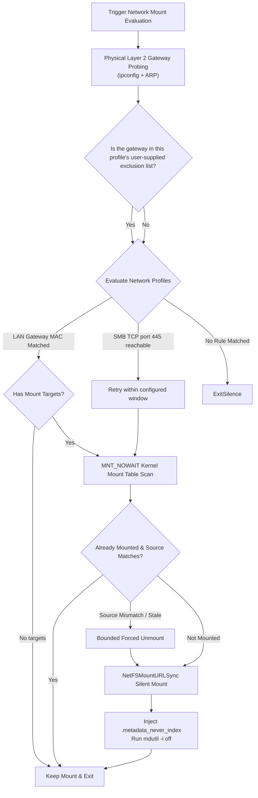
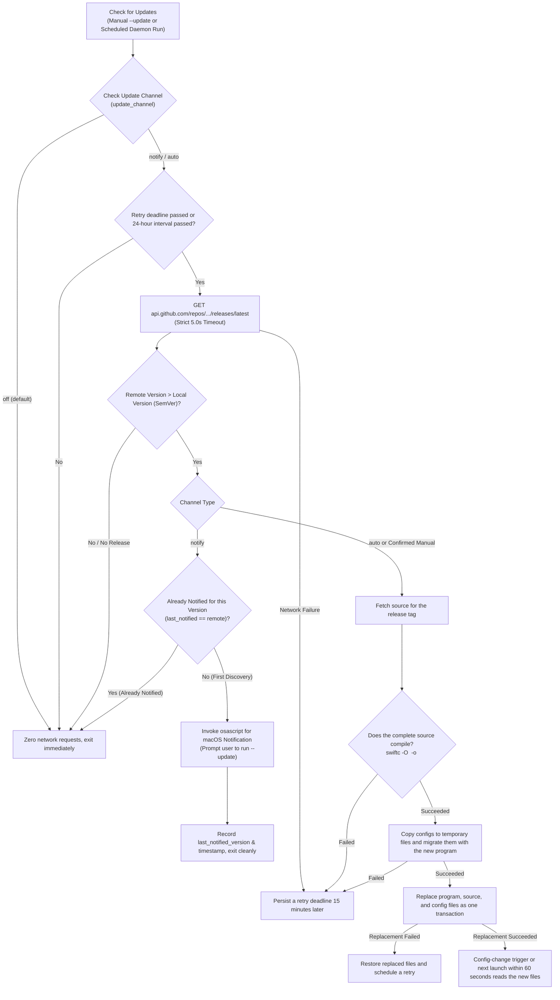
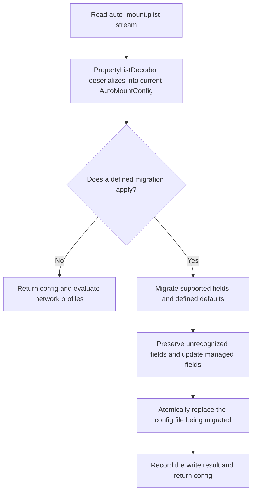

# Network Evaluation Flow

When mounting network storage volumes in macOS automation workflows, high-level blocking APIs and permission barriers must be avoided by following a deterministic technical path:



# Supported Platforms and Implementation Policy

AutoMount supports Apple silicon (arm64) devices running macOS 27.0 or later. Intel (x86_64) Macs and macOS releases before 27.0 are unsupported. The prebuilt CLI and installer-compiled daemon target `arm64-apple-macosx27.0`; direct Swift source execution also checks the OS version and architecture and rejects unsupported environments.

The macOS 27 SDK and APIs introduced in that release are the preferred development target, with correctness on macOS 27 as the primary acceptance criterion. Keep the implementation concise and do not retain compatibility branches for older macOS releases or Intel. Keep runtime fallbacks only where they handle current network, filesystem, or recovery conditions. Configuration migration is a separate requirement and remains necessary to upgrade user configuration safely between program versions.

## Empty-Target Profile Behavior

* **Empty targets**: When a higher-priority network profile (such as `local_lan`) has an empty `targets` array, the program treats that matching profile as complete and stops evaluating lower-priority profiles.
* **Profile order**: On another network, a gateway MAC mismatch lets evaluation continue to later profiles, including remote profiles.

## Mount API Selection

* **Use `NetFSMountURLSync`**: The program leaves credential parameters empty and sets the non-interactive NetAuth option. macOS can use existing Keychain credentials; if none are available, mounting fails with a diagnostic instead of opening a credential prompt.

## Network Topology Probing Selection

* **Route Source Selection**: The program first checks the default IPv4 route. If that route does not use a physical Ethernet interface, it falls back to DHCP router information supplied for physical interfaces.
* **Interface-Scoped ARP Lookup**: After identifying an IPv4 gateway and physical interface, the program reads that interface's ARP neighbor entry and briefly probes the gateway when needed. Detection depends on the routing, DHCP, and ARP information exposed by the current system; it is not guaranteed under every VPN, network service, or privacy restriction.


# Key Runtime Behavior

## Silent Mounting Through NetFS

The program validates the SMB URL and mount path before calling `NetFSMountURLSync` with the requested mount point, empty credentials, and the non-interactive NetAuth option. For a missing standard `/Volumes/<share>` path, it leaves the mount point empty so NetFS can create the directory. After a successful return, the program checks the kernel mount table for the actual path and SMB source. If no usable Keychain credential exists, the operation fails and records a diagnostic.

## Non-Blocking Kernel Mount Table Inspection

Never use `FileManager.default.fileExists` or POSIX `stat()` on network volume paths that might be unreachable; doing so blocks the calling thread in kernel sleep and causes system spinning beachball hangs. Use `getfsstat` with the `MNT_NOWAIT` flag instead:

```swift
import Darwin

struct ActiveMountRecord {
    let mountPath: String
    let sourceURL: String
}

func queryActiveKernelMounts() -> [ActiveMountRecord] {
    let count = getfsstat(nil, 0, MNT_NOWAIT)
    guard count > 0 else { return [] }
    
    var buffer = [statfs](repeating: statfs(), count: Int(count))
    let actualCount = buffer.withUnsafeMutableBufferPointer { ptr in
        getfsstat(ptr.baseAddress, count * Int32(MemoryLayout<statfs>.size), MNT_NOWAIT)
    }
    
    var results: [ActiveMountRecord] = []
    for i in 0..<Int(actualCount) {
        let entry = buffer[i]
        let path = withUnsafePointer(to: entry.f_mntonname) {
            $0.withMemoryRebound(to: CChar.self, capacity: Int(MAXPATHLEN)) { String(cString: $0) }
        }
        let source = withUnsafePointer(to: entry.f_mntfromname) {
            $0.withMemoryRebound(to: CChar.self, capacity: Int(MAXPATHLEN)) { String(cString: $0) }
        }
        results.append(ActiveMountRecord(mountPath: path, sourceURL: source))
    }
    return results
}
```

## Timeout-Protected Cleanup for Stale SMB Mounts

The program first checks that the configured path currently contains an SMB filesystem. If another filesystem occupies the path, it is preserved and reported as a conflict. For an SMB source that must be switched, `diskutil unmount force` and a fallback `umount -f` share a bounded time budget. A second unmount is not started while the first child may still be running.

## Spotlight Indexing and Gateway Exclusions

After mounting, the program requests `mdutil -i off` and attempts to create `.metadata_never_index`. Both results are logged. If macOS or the SMB share rejects either operation, the program reports that indexing prevention could not be confirmed.

## Physical Network Topology and ARP Lookup

The program first checks `route -n get default`. If the route uses a physical Ethernet interface and has an IPv4 gateway, it queries that interface's ARP neighbor entry; otherwise it falls back to DHCP router information for physical interfaces. The lookup runs `/usr/sbin/arp -n -i <interface> <ip>` and briefly probes the gateway when the neighbor entry is missing. VPNs or network services can change route and neighbor data, so gateway detection is not guaranteed for every setup.


# LaunchAgent Triggers

The LaunchAgent uses `RunAtLoad` at user login, watches the system network configuration directory and runtime config, and reevaluates policy on a 60-second `StartInterval`. launchd controls when `WatchPaths` events fire; the interval covers delayed network readiness and missed file events.

## Service Definition Standard (`~/Library/LaunchAgents/com.user.auto-mount.plist`)

```xml
<?xml version="1.0" encoding="UTF-8"?>
<!DOCTYPE plist PUBLIC "-//Apple//DTD PLIST 1.0//EN" "http://www.apple.com/DTDs/PropertyList-1.0.dtd">
<plist version="1.0">
<dict>
    <key>Label</key>
    <string>com.user.auto-mount</string>
    <key>ProgramArguments</key>
    <array>
        <string>/usr/bin/swift</string>
        <string>/Users/USERNAME/Library/Application Support/AutoMount/auto_mount.swift</string>
    </array>
    <key>WatchPaths</key>
    <array>
        <string>/Library/Preferences/SystemConfiguration</string>
        <string>/Users/USERNAME/Library/Application Support/AutoMount/auto_mount.plist</string>
    </array>
    <key>RunAtLoad</key>
    <true/>
    <key>StartInterval</key>
    <integer>60</integer>
    <key>StandardOutPath</key>
    <string>/tmp/com.user.auto-mount.stdout.log</string>
    <key>StandardErrorPath</key>
    <string>/tmp/com.user.auto-mount.stderr.log</string>
</dict>
</plist>
```

The installer deploys the compiled CLI and Swift source. On first install, it seeds the runtime config from the workspace. On reinstall, it compares user settings while ignoring the config version and daemon update-check state, and preserves the runtime config when settings match. If two valid configs differ, an interactive install asks which one to use; a non-interactive install keeps the runtime config. `--config-source workspace` and `--config-source runtime` explicitly select the source. An invalid or newer runtime config is never silently overwritten; repair requires an explicit workspace selection. The LaunchAgent starts the runtime source through `/usr/bin/swift` so network detection can read interface-scoped neighbor entries in the logged-in session; the compiled executable remains available for interactive commands.

## Modern Registration and Lifecycle Management

On macOS 27 and later, use modern `bootstrap` and `bootout` commands rather than legacy `launchctl load` / `unload`:

```bash
# Obtain current GUI user UID
UID=$(id -u)

# Unload previous service instance if present
launchctl bootout "gui/${UID}/com.user.auto-mount" 2>/dev/null || true

# Register and load service
launchctl bootstrap "gui/${UID}" ~/Library/LaunchAgents/com.user.auto-mount.plist

# Verify current service status
launchctl list | grep com.user.auto-mount
```


# Troubleshooting and Edge Case Runbook

## SMB Service Readiness After a Network Change

* **Symptom**: A remote SMB target cannot be mounted immediately after a network change or wake.
* **Possible Cause**: DNS, overlay-network routing, or the server's SMB service may not be ready yet.
* **Mitigation**: Remote profiles probe SMB over TCP port 445 and retry using the configured window (3 attempts, 1 second apart by default). This confirms SMB port reachability; it does not inspect Tailscale tunnel handshake state.

## Local Area Network mDNS Resolution Instability

* **Symptom**: `smb://server.local/share` occasionally fails to resolve, even though the server is online.
* **Diagnostic Procedure**:
  ```bash
  # 1. Verify service advertisement
  dns-sd -B _smb._tcp local.

  # 2. Bypass mDNS and query direct IP address
  smbutil lookup server
  ```
* **Mitigation**: Configure static hostnames or IP addresses instead of relying solely on mDNS broadcasts, or maintain fallback IP mappings in configuration profiles.

# CLI Control Layer & Interaction Architecture

## Unified Configuration Dashboard & Orthogonal Subcommands

AutoMount CLI merges the classic UNIX orthogonal philosophy with modern interactive console UX:

* **Underlying Orthogonal Commands**: `--install`, `--uninstall`, and `--status` serve as dedicated, non-interactive subcommands designed for automated provisioning, scripts, and CI/CD operations.
* **Aggregated Configuration Center**: `--config` functions as an all-in-one control center displaying the live LaunchAgent status (`gui/<uid>`) while incorporating service deployment, reload, status checks, and uninstallation into a unified menu.
* **Initial Setup**: `--init` handles gateway detection, target selection, remote profile setup, update channel choice, and optional LaunchAgent deployment in five steps.
* **Defensive Parameter Validation**: Enforces strict CLI argument validation; unrecognized options are immediately rejected with standard usage instructions, preventing unintended execution of unmount or mount sequences.

## Zero-Dependency Native Localization (i18n)

* **System Language Adaptation**: Inspects `Locale.preferredLanguages` to select English or Simplified Chinese.
* **Environment Variable Override**: Supports `AUTO_MOUNT_LANG=zh|en` for explicit language specification and testing.
* **Lightweight Embedded Translation Engine**: Dispatches localized strings directly within the standalone Swift file without external `.strings` bundles, preserving portability and zero external dependencies.

# Runtime Update and Deployment

The updater supports manual checks, optional background channels, and synchronization between the workspace and LaunchAgent runtime. It stages config migrations and replaces target files with rollback support:



## 1. 24-Hour Cooldown Window & Debouncing

* **Check Interval**: After a successful release query, normal checks wait 24 hours. Network, download, build, migration, or deployment failures persist `update_retry_after_timestamp` and retry after 15 minutes, bypassing the normal interval.
* **Mounting Task Priority**: Background update checks run after mount evaluation. A network request can delay the process exit, but it does not precede the configured mount actions.

## 2. Single-Notification Anti-Fatigue Mechanism

* **Alert Fatigue Prevention**: For the `notify` channel, AutoMount stores `last_notified_version` in the configuration. Once a system banner has been displayed for a newly released build, this version tag is persisted to disk.
* **Release-Bound Trigger**: Even across network switches after the 24-hour cooldown expires, if the remote release tag remains identical to `last_notified_version`, the notification is suppressed, avoiding repetitive alerts. Only when a newer version is tagged upstream will a new notification be triggered.

## 3. Complete Build Check

* **Single-File Crash Hazard**: In standalone single-file architectures, corrupt downloads caused by proxy injection or incomplete network transfers can result in continuous launchd crash loops.
* **Compiler Safety Gate**: AutoMount writes downloaded source to a temporary file and runs `swiftc -O` to build a staged executable. Installed files are replaced only after the complete build succeeds; a build failure preserves the old executable and returns failure.

## 4. Transactional Deployment and Daemon Continuity

* **Workspace & Runtime Parity**: The updater prepares the program and source for each eligible directory. Existing configs are copied to temporary files and migrated by the new program. A workspace with uncommitted source changes is left untouched by a background update.
* **Transactional Replacement**: All target files are prepared before deployment. If a replacement fails, the updater restores files already replaced and logs any rollback failure.
* **No Self-Unload**: The updater does not call `launchctl bootout` from the LaunchAgent process. The agent uses stable Application Support paths, so a config-change event or 60-second interval reads the new files. The updater does not start a service that was previously unloaded.

# Unified Versioning & In-Place Schema Migration

## 1. Config Version

AutoMount uses one version value: the config's root-level `version` is updated to match the software semantic version in `autoMountVersion` when a defined migration runs.

## 2. Defined Config Migrations

When loading config, AutoMount applies its defined migrations for version changes, missing defaults, and supported legacy profile names:



## 3. Config Compatibility and Persistence

* **Field Preservation**: Migration updates managed fields while preserving unrecognized root, profile, match-rule, and mount-target fields;
* **Atomic Persistence and Permissions**: Config data is written to a temporary file with mode `0600`, synchronized, and atomically renamed into place;
* **Management Config Path**: When a LaunchAgent and runtime config exist, `--config` reads and edits `~/Library/Application Support/AutoMount/auto_mount.plist`. It uses the workspace config only when no runtime config is installed. Workspace and runtime configs migrate independently.

## 4. Workspace and Runtime Version Synchronization

After LaunchAgent deployment, the workspace and `~/Library/Application Support/AutoMount` may each contain a program and config copy.

When `--update` runs from the workspace, the updater downloads source, compiles a staged executable, and migrates temporary config copies before replacing runtime files and a clean workspace transactionally. The LaunchAgent stays loaded, uses its stable runtime path, and reads the new files on a config-change trigger or its next launch within 60 seconds.

When a workspace command detects a newer runtime version, it checks the Git status of `auto_mount.swift`. If the source has uncommitted changes, the program asks before replacing them and defaults to keeping the workspace copy. It stages config migration and compiles the runtime source before replacing workspace files. Existing workspace config is migrated without being overwritten by runtime config; runtime config is copied only when the workspace config is missing. If a deployment replacement fails, the program attempts to restore the prior files.
