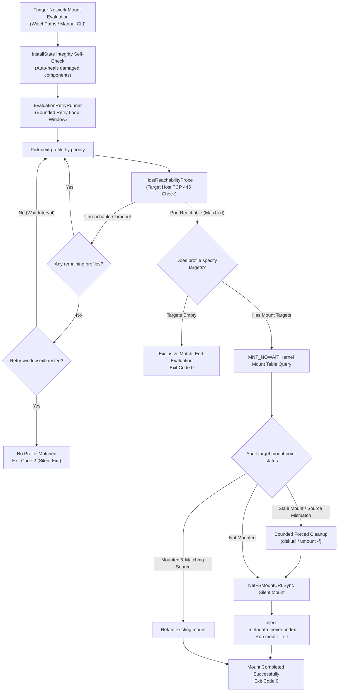

# Network Evaluation and Mount Flow

automnt evaluates network profiles sequentially, uses target host TCP 445 reachability probes for decision-making, audits kernel mount status, and mounts target SMB shares on demand:


```mermaid
flowchart TD
    Start["Trigger Network Mount Evaluation\n(WatchPaths / Manual CLI)"] --> HealthCheck["InstallState Integrity Self-Check\n(Auto-heals damaged components)"]
    HealthCheck --> RetryLoop["EvaluationRetryRunner\n(Bounded Retry Loop Window)"]
    
    RetryLoop --> NextProfile["Pick next profile by priority"]
    NextProfile --> HostProbe["HostReachabilityProbe\n(Target Host TCP 445 Check)"]
    
    HostProbe -- "Unreachable / Timeout" --> HasMoreProfiles{"Any remaining profiles?"}
    HasMoreProfiles -- "Yes" --> NextProfile
    HasMoreProfiles -- "No" --> WindowCheck{"Retry window exhausted?"}
    WindowCheck -- "No (Wait Interval)" --> NextProfile
    WindowCheck -- "Yes" --> ExitSilent["No Profile Matched\nExit Code 2 (Silent Exit)"]
    
    HostProbe -- "Port Reachable (Matched)" --> HasTargets{"Does profile specify targets?"}
    HasTargets -- "Targets Empty" --> ExitSuccess["Exclusive Match, End Evaluation\nExit Code 0"]
    HasTargets -- "Has Mount Targets" --> KernelScan["MNT_NOWAIT Kernel Mount Table Query"]
    
    KernelScan --> TargetAudit{"Audit target mount point status"}
    TargetAudit -- "Mounted & Matching Source" --> KeepMount["Retain existing mount"]
    TargetAudit -- "Stale Mount / Source Mismatch" --> BoundedClean["Bounded Forced Cleanup\n(diskutil / umount -f)"]
    BoundedClean --> DoMount["NetFSMountURLSync Silent Mount"]
    TargetAudit -- "Not Mounted" --> DoMount
    
    DoMount --> SpotlightShield["Inject .metadata_never_index\nRun mdutil -i off"]
    SpotlightShield --> Finish["Mount Completed Successfully\nExit Code 0"]
    KeepMount --> Finish
```

# Supported Platforms and Implementation Policy

automnt is engineered exclusively for Apple silicon (arm64) running macOS 27.0 or later. Intel (x86_64) Macs and versions prior to macOS 27.0 are unsupported.

- **Deterministic Framework Selection**: Leverages native `NetFSMountURLSync` with Keychain credentials, eliminating user-facing modal dialogs.
- **Service Reachability Focus**: Eliminates fragile link-layer MAC/ARP sniffing in favor of transport-layer reachability checks (`HostReachabilityProbe`), natively compatible with multi-homed setups, Tailscale, WireGuard, and VLANs.
- **Event-Driven Daemon Execution**: The LaunchAgent monitors system configuration events exclusively, avoiding wasteful `StartInterval` polling.
- **Single Active Configuration Contract**: Uses `~/Library/Application Support/automnt/automnt.plist` as the single source of truth with strict `0600` permissions.

# Key Runtime Mechanisms

## Host Reachability Probing (HostReachabilityProbe)

During policy evaluation, automnt initiates non-blocking BSD socket connections against port 445 on the destination host:

```swift
struct HostReachabilityProbe {
    static func canConnect(host: String, port: Int = 445, timeoutMs: Int = 1000) -> Bool
}
```

- Connection timeout is bounded (500 to 1000 ms) to prevent execution stalling.
- Successful handshake establishes an immediate profile match.
- Connection refused (RST), unreachable routes (ENETUNREACH / EHOSTUNREACH), or timeouts fall through to subsequent profiles.

## Event-Driven Retry Runner (EvaluationRetryRunner)

Network changes, Wi-Fi handshakes, and VPN tunnels often introduce brief connection delays. The LaunchAgent invokes a bounded retry runner:

```swift
struct EvaluationRetryRunner {
    let policy: RetryPolicy
    func run<T>(_ work: () -> T?) -> T?
}
```

- Default configuration: up to 3 attempts, 1000 ms interval, 10000 ms total window.
- Successful connection immediately triggers mounting.
- If no profiles match upon window expiration, the runner exits with status `2`, signaling launchd that the event was processed without error.

## Non-Blocking Mount Snapshots

Never use POSIX `stat()` or Foundation `FileManager` on remote paths that may have become disconnected. automnt queries the Darwin kernel directly:

```swift
func queryActiveKernelMounts() -> [ActiveMountRecord] {
    let count = getfsstat(nil, 0, MNT_NOWAIT)
    guard count > 0 else { return [] }
    var buffer = [statfs](repeating: statfs(), count: Int(count))
    let actualCount = buffer.withUnsafeMutableBufferPointer { ptr in
        getfsstat(ptr.baseAddress, count * Int32(MemoryLayout<statfs>.size), MNT_NOWAIT)
    }
    // Parse mount path and remote source from buffer
}
```

Operating directly on the kernel VFS mount table ensures microsecond return times regardless of network connectivity.

## Bounded Cleanup for Dead Mounts

When an existing mount is unresponsive or needs reassignment, automnt executes cleanup across two bounded tiers:
1. `diskutil unmount force <path>` as primary mechanism;
2. Fallback to `umount -f <path>` if needed;
3. Bounded timeouts ensure concurrent operations do not collide.

## Spotlight Indexing Shield

Upon mount completion, automnt applies two-tier indexing suppression:
1. Calls `/usr/bin/mdutil -i off <mountPath>` to request metadata indexing deactivation;
2. Creates `.metadata_never_index` in the root of the network volume.

## Compiler-Free Self-Updates and Health Self-Healing

- **Precompiled Binary Delivery**: Downloads official `automnt` binaries from GitHub Releases, avoiding user-side build dependencies.
- **Transactional Staging**: Validates binary integrity in sandbox staging before atomically replacing `~/Library/Application Support/automnt/bin/automnt`.
- **Integrity Self-Healing**: Checks `InstallState` on launch, repairing missing LaunchAgent plists or stripped shell PATHs automatically.
