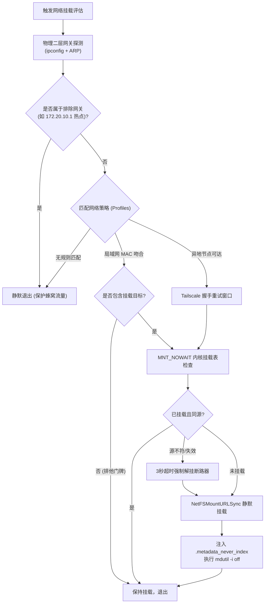
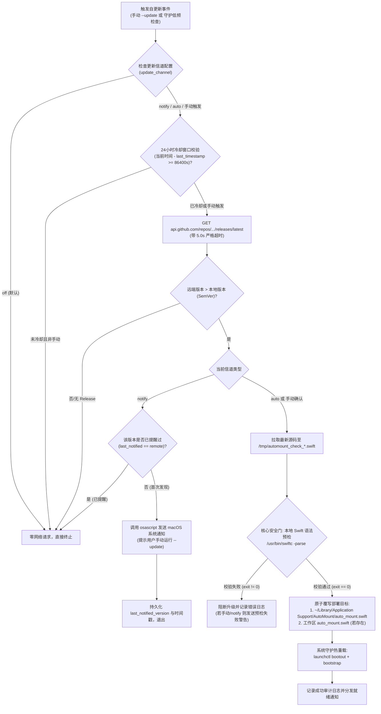
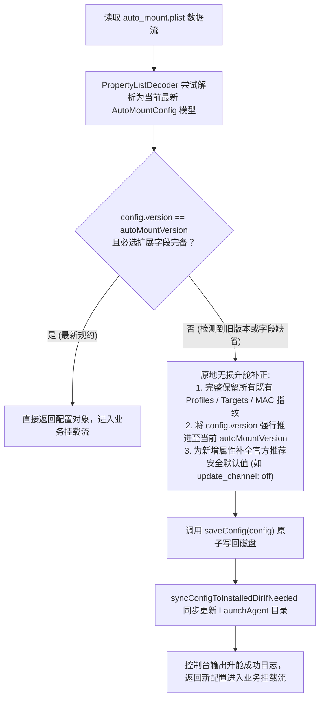

# 核心架构与决策模型

在 macOS 自动化流程中挂载网络存储卷宗时，必须避开高层阻塞 API 与权限陷阱，遵循确定性技术路线：



## 网络排他门牌机制 (Exclusion Gatekeeper)

* **空目标截断设计**：当策略路由配置中某个高优先级策略（如 `home_lan`）的 `targets` 声明为空数组 `[]` 时，该策略即作为网络排他门牌运作。
* **确定性路由截断**：一旦物理网关 MAC 命中该策略，引擎完成 0 个挂载任务后立即终止后续策略评估，从架构上彻底阻断低优先级异地策略（如 Tailscale）被误触发；当设备物理离开该网络时，网关 MAC 指纹失效，流量与挂载逻辑自然降级流转至后续异地策略。

## 挂载 API 的确定性选型

* **禁止使用 `mount_smbfs`**：该命令无法直接读取 macOS 钥匙串 (Keychain)，强制要求明文密码配置文件或交互输入，且高版本 macOS 中容易产生权限弹窗。
* **强制使用 `NetFSMountURLSync`**：系统级 C 接口，传入 `nil` 凭据参数时自动无缝唤起钥匙串静默鉴权，不产生任何访达窗口或交互请求。

## 网络拓扑探测的抗干扰选型

* **高层 Wi-Fi API 的局限**：自 macOS 14 起，CoreWLAN 读取 SSID 受到严格权限隔离；且当系统运行全局 VPN（如 TUN 虚拟网卡）时，系统网络栈默认路由被劫持，导致高层网络状态判断失效。
* **物理二层 ARP 网关指纹**：通过遍历物理接口（`en0` 等）并读取 DHCP 路由器 IP，再通过二层 ARP 表获取路由器的物理 MAC 地址。该机制完全穿透 TUN 隧道，100% 反映真实接入的物理硬件，且完全免 `sudo`。


# 生产级核心代码模式 (Swift)

## 钥匙串免密静默挂载范式

通过系统 `NetFS` 框架直接挂载，不弹出访达窗口：

```swift
import Foundation
import NetFS

func mountSMBVolumeSilently(urlString: String) -> Bool {
    guard let url = CFURLCreateWithString(kCFAllocatorDefault, urlString as CFString, nil) else {
        return false
    }
    
    var mountPoints: Unmanaged<CFArray>?
    // 关键：User、Password 均传 nil，强制底层读取系统 Keychain
    let status = NetFSMountURLSync(
        url,
        nil,
        nil,
        nil,
        nil,
        nil,
        &mountPoints
    )
    
    if let points = mountPoints {
        points.release()
    }
    
    return status == noErr
}
```

## 内核挂载表非阻塞扫描 (防假死核心)

严禁在远程网络卷宗可能断网失效时使用 `FileManager.default.fileExists` 或 POSIX `stat()`，否则会导致调用线程进入内核级等待并触发系统彩虹球假死。必须使用 `getfsstat` 配合 `MNT_NOWAIT` 标志位：

```swift
import Darwin

struct ActiveMountRecord {
    let mountPath: String
    let sourceURL: String
}

func queryActiveKernelMounts() -> [ActiveMountRecord] {
    let count = getfsstat(nil, 0, MNT_NOWAIT)
    guard count > 0 else { return [] }
    
    var buffer = [statfs](repeating: statfs(), count: Int(count))
    let actualCount = buffer.withUnsafeMutableBufferPointer { ptr in
        getfsstat(ptr.baseAddress, count * Int32(MemoryLayout<statfs>.size), MNT_NOWAIT)
    }
    
    var results: [ActiveMountRecord] = []
    for i in 0..<Int(actualCount) {
        let entry = buffer[i]
        let path = withUnsafePointer(to: entry.f_mntonname) {
            $0.withMemoryRebound(to: CChar.self, capacity: Int(MAXPATHLEN)) { String(cString: $0) }
        }
        let source = withUnsafePointer(to: entry.f_mntfromname) {
            $0.withMemoryRebound(to: CChar.self, capacity: Int(MAXPATHLEN)) { String(cString: $0) }
        }
        results.append(ActiveMountRecord(mountPath: path, sourceURL: source))
    }
    return results
}
```

## 失效挂载的超时熔断与强制清理

当网络环境改变导致已有挂载点变为“僵死”状态时，必须施加严格的 3 秒超时限制，采用两级强退机制：

```swift
import Foundation
import Darwin

func forceUnmountStaleVolume(at mountPath: String, timeout: Double = 3.0) -> Bool {
    let group = DispatchGroup()
    var success = false
    
    group.enter()
    DispatchQueue.global(qos: .userInitiated).async {
        // 第一阶段：优雅强制卸载
        let task = Process()
        task.executableURL = URL(fileURLWithPath: "/usr/sbin/diskutil")
        task.arguments = ["unmount", "force", mountPath]
        try? task.run()
        task.waitUntilExit()
        
        if task.terminationStatus == 0 {
            success = true
        } else {
            // 第二阶段：POSIX 内核层强制解挂
            success = (unmount(mountPath, MNT_FORCE) == 0)
        }
        group.leave()
    }
    
    let result = group.wait(timeout: .now() + timeout)
    return result == .success && success
}
```

## Spotlight 检索防护与移动热点保护

挂载成功后必须立即执行元数据检索屏蔽，避免远端大容量磁盘检索造成系统发热与网络卡顿：

```swift
import Foundation

func protectVolumeFromSpotlight(mountPath: String) {
    let flagFile = (mountPath as NSString).appendingPathComponent(".metadata_never_index")
    if !FileManager.default.fileExists(atPath: flagFile) {
        FileManager.default.createFile(atPath: flagFile, contents: nil)
    }
    
    let task = Process()
    task.executableURL = URL(fileURLWithPath: "/usr/bin/mdutil")
    task.arguments = ["-i", "off", mountPath]
    try? task.run()
    task.waitUntilExit()
}
```

## 物理网络拓扑与 ARP 硬件提取

绕过 TUN 路由劫持，直探物理链路层：

```swift
import Foundation
import SystemConfiguration

func getPhysicalGatewayIP() -> (ip: String, interface: String)? {
    guard let interfaces = SCNetworkInterfaceCopyAll() as? [SCNetworkInterface] else { return nil }
    for iface in interfaces {
        guard let name = SCNetworkInterfaceGetBSDName(iface) as String?, name.starts(with: "en") else { continue }
        let task = Process()
        task.executableURL = URL(fileURLWithPath: "/usr/sbin/ipconfig")
        task.arguments = ["getoption", name, "router"]
        let pipe = Pipe()
        task.standardOutput = pipe
        try? task.run()
        task.waitUntilExit()
        let data = pipe.fileHandleForReading.readDataToEndOfFile()
        if let ip = String(data: data, encoding: .utf8)?.trimmingCharacters(in: .whitespacesAndNewlines), !ip.isEmpty {
            return (ip, name)
        }
    }
    return nil
}

func getGatewayMAC(for ip: String) -> String? {
    let task = Process()
    task.executableURL = URL(fileURLWithPath: "/usr/sbin/arp")
    task.arguments = ["-n", ip]
    let pipe = Pipe()
    task.standardOutput = pipe
    try? task.run()
    task.waitUntilExit()
    let data = pipe.fileHandleForReading.readDataToEndOfFile()
    guard let output = String(data: data, encoding: .utf8) else { return nil }
    
    let pattern = "([0-9a-fA-F]{1,2}(?::[0-9a-fA-F]{1,2}){5})"
    guard let regex = try? NSRegularExpression(pattern: pattern),
          let match = regex.firstMatch(in: output, range: NSRange(output.startIndex..., in: output)),
          let range = Range(match.range(at: 1), in: output) else {
        return nil
    }
    return String(output[range]).lowercased()
}
```


# 系统级常驻自动化规范 (LaunchAgent)

不同于依赖上层轮询的 Cron 机制，macOS 原生网络监听通过 launchd 的 `WatchPaths` 订阅系统网络配置目录，实现零内存常驻、秒级事件唤醒。

## 描述文件配置标准 (`~/Library/LaunchAgents/com.user.auto-mount.plist`)

```xml
<?xml version="1.0" encoding="UTF-8"?>
<!DOCTYPE plist PUBLIC "-//Apple//DTD PLIST 1.0//EN" "http://www.apple.com/DTDs/PropertyList-1.0.dtd">
<plist version="1.0">
<dict>
    <key>Label</key>
    <string>com.user.auto-mount</string>
    <key>ProgramArguments</key>
    <array>
        <string>/Users/USERNAME/Library/Application Support/AutoMount/auto_mount</string>
    </array>
    <key>WatchPaths</key>
    <array>
        <string>/Library/Preferences/SystemConfiguration</string>
    </array>
    <key>RunAtLoad</key>
    <true/>
    <key>StandardOutPath</key>
    <string>/tmp/com.user.auto-mount.stdout.log</string>
    <key>StandardErrorPath</key>
    <string>/tmp/com.user.auto-mount.stderr.log</string>
</dict>
</plist>
```

## 现代注册与生命周期管理命令

在 macOS 13+ / 26+ / 27+ 环境中，弃用已废弃的 `launchctl load / unload`，采用现代 `bootstrap / bootout` 子命令：

```bash
# 获取当前控制台用户 UID
UID=$(id -u)

# 卸载旧服务 (若存在)
launchctl bootout "gui/${UID}/com.user.auto-mount" 2>/dev/null || true

# 注册并加载服务
launchctl bootstrap "gui/${UID}" ~/Library/LaunchAgents/com.user.auto-mount.plist

# 验证服务当前运行状态
launchctl list | grep com.user.auto-mount
```


# 故障诊断与边缘场景排障手册

## 异地 WireGuard / Tailscale 握手延迟

* **现象**：刚切换至外网时，Tailscale 节点已激活，但首次挂载偶发超时失败。
* **原因**：WireGuard 隧道建立需要数十毫秒至数百毫秒的协商握手期。
* **解决方案**：引入轻量重试窗口，在主机可达性探测阶段设置 3 次探测重试（每次间隔 1.0 秒），捕获握手就绪时刻后再发起 NetFS 调用。

## 局域网 mDNS 解析不稳定

* **现象**：`smb://server.local/share` 偶发无法解析，但主机实际在线。
* **排查手段**：
  ```bash
  # 1. 检查服务宣告状态
  dns-sd -B _smb._tcp local.

  # 2. 绕过 mDNS 查询直连 IP
  smbutil lookup server
  ```
* **容灾方案**：在配置中使用静态主机名或固定 IP 替代单点 mDNS 广播，或在策略中维护备用 IP 回退列表。

# CLI 控制层与交互架构设计

## 一站式配置中心与正交子命令协同模型

AutoMount CLI 在架构设计上融合了经典 UNIX 正交哲学与现代交互式控制台美学：

* **底层正交可脚本化**：`--install`、`--uninstall`、`--status` 作为独立顶级子命令存在，具备确定性与免交互特性，便于自动化运维脚本与 CI/CD 流程调用。
* **高层聚合控制中心**：`--config` 作为一站式交互控制面板，直接展示后台守护进程的运行时状态（`gui/<uid>`），并将服务安装、重载、查看与卸载作为子菜单纳入统一管理，降低日常维护认知成本。
* **首次配置闭环**：`--init` 将硬件探测、挂载目标、远程策略、更新策略与服务注册合为五步一体的完整闭环，消除“配置已完成但后台未部署”的体验断层。
* **防御性参数拦截**：采用严格的命令行参数解析，任何未知参数均立即终止并打印标准使用规范，杜绝参数拼写错误导致误触发网络挂载与解挂操作。

## 零依赖原生国际化 (i18n) 架构

* **系统语言自适应**：优先检测 macOS 系统的 `Locale.preferredLanguages`，在非中文系统下默认自适应为英文界面。
* **环境变量控制**：支持通过 `AUTO_MOUNT_LANG=zh|en` 环境变量对运行期界面语言进行显式覆写与测试。
* **轻量双语分发引擎**：在纯 Swift 单文件内通过内置映射函数分发，不引入外部 `.strings` 依赖，保证跨机器运行的自包含性与便携性。

# 自动更新与热重载架构 (Self-Update & Hot-Reload Engine)

为了让后台静默运行的守护进程与用户工作区能够平滑无感知升级，同时彻底杜绝网络波动或代码损坏导致系统级守护服务崩溃，AutoMount 设计了双通道安全自升级生命周期模型：



## 1. 24 小时冷却时间窗口与防抖机制

* **低频轻量原则**：即便配置了 `notify` 或 `auto` 策略，守护进程每次因网络切换被唤醒时，首先比对 `last_update_check_timestamp`。若距离上次检查不足 86,400 秒（24 小时），更新逻辑在纳秒级直接短路返回，杜绝高频切网（如频繁插拔网线或 Wi-Fi 信号跳动）对 GitHub API 造成滥用或触发速率限制（Rate Limit）。
* **任务优先级让渡**：后台更新检查始终放置于网络挂载执行完成后触发，确保核心的网络存储挂载任务以毫秒级最高优先级执行，不因远端 HTTP 请求延迟干扰挂载体验。

## 2. 单版本单次提醒防打扰机制

* **防疲劳轰炸设计**：针对 `notify` 模式，系统在配置文件中维护 `last_notified_version` 属性。当检测到远端新版本并成功投递 1 次系统通知横幅后，该版本号即刻固化存盘。
* **版本更新触发**：后续即便跨越了 24 小时冷却窗口且多次触发网络切换，只要远端最新版本依然等于 `last_notified_version`，通知逻辑将自动抑制跳过，绝对不反复骚扰用户；仅当官方后续发布了更新的版本时，才会解除抑制并发送针对新版本的单次通知。

## 3. 本地 `swiftc -parse` 语法预检断路器

* **单文件自升级的崩溃风险**：对于无外部依赖的单文件脚本，若从远端下载的代码遭遇网络截断、代理劫持注入或语法破坏，直接覆盖运行文件将导致后续 `launchd` 唤醒时进程崩溃死锁。
* **编译期抽象语法树安全门**：AutoMount 在落地新文件前，必须将下载的源码写入临时文件，并调用系统内置的 `/usr/bin/swiftc -parse <tempFile>` 驱动 Swift 前端完成完整的抽象语法树解析。只有返回码为 0 时才判定为可执行代码，任何解析错误均立即触发断路器阻断部署，保障已部署系统的稳定运行。

## 4. 双端原子同步与平滑热重载

* **双环境同步机制**：`performSelfUpdate` 识别当前是否同时存在工作区源码与 `~/Library/Application Support/AutoMount` 部署目录。若两处皆存在，自升级引擎原子同步更新两个副本，消除“开发者更新了代码但守护程序依然运行旧版本”或“日常运行目录更新但版本控制未同步”的认知脱节。
* **热重载无需重启**：更新完成后，主程序无缝调用 `launchctl bootout` 与 `launchctl bootstrap` 重载 `com.user.auto-mount` 服务，新代码在下一次网络事件触发时即刻生效，全程无需重启计算机或重登用户会话。

# 单一版本体系与原地配置无损升舱 (In-Place Schema Auto-Migration)

## 1. 废弃多轨双重版本体系的设计哲学

在传统的配置驱动工具中，往往存在“软件版本号（如 `2.1.0`）”与“配置文件格式版本号（如 `2.0` / `2.1`）”并存的双轨制。随着业务特性的持续迭代，双轨体系会迅速带来高昂的心智与工程负债：
* **开发者认知割裂**：代码中必须长期维护兼容旧版本配置的数据解析分流逻辑（例如同时维护多套历史结构体），增加了编译单元与控制流的复杂度；
* **用户运维困惑**：当用户看到软件已更新至新版本，但配置文件仍标注着老旧版本号时，往往产生兼容性疑虑或误认为升级未完全生效；
* **升级断层风险**：用户若手动修改了配置文件版本，可能导致向下兼容逻辑误判，进而造成字段缺失或解析异常。

为此，AutoMount 彻底废弃双轨版本制，推行**单一全局版本号契约**：配置文件根层级的 `version` 必须且始终严格对齐主程序二进制的语义化版本号（`autoMountVersion`）。

## 2. 运行时原地自动升舱机制 (In-Place Migration)

为彻底消灭复杂的历史版本向下兼容分流逻辑，AutoMount 确立了**“以当前最新标准为唯一真理，启动即原地升舱”**的架构原则：



## 3. 升舱安全性与数据不灭定律

* **业务数据严格不可变**：升舱算法仅针对结构规范的演进（如新增功能开关、默认策略注入），已有的所有网关物理指纹、挂载点映射、排除网关 IP 等用户既有数据受到不可变保护，绝不被丢弃或重写；
* **原子写回与权限固化**：修改后的配置通过 `Data.write(to:options: .atomic)` 原子写入，配合 `chmod 644` 权限校验，杜绝掉电、宕机引发的配置文件损坏；
* **双环境无缝协同**：升舱动作触发后，不仅更新当前加载目录的配置文件，还会自动检测并同步刷新 `~/Library/Application Support/AutoMount/auto_mount.plist`，确保无论以后台守护运行还是控制台手动调试，配置结构永远与底层运行程序保持最新的一致性。

