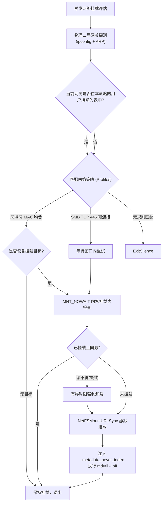
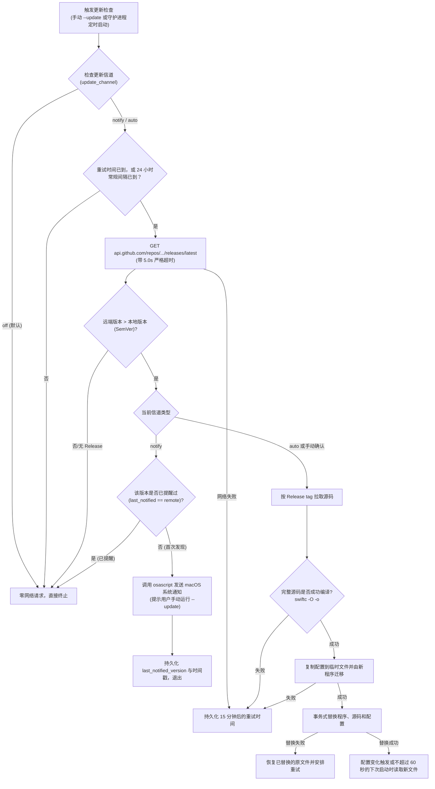
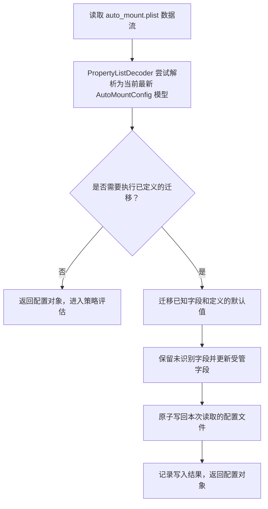

# 网络评估流程

AutoMount 依次识别网络策略、检查 SMB 挂载状态，并挂载当前策略配置的共享：



# 支持平台与实现原则

AutoMount 仅支持 Apple silicon（arm64）设备和 macOS 27.0 或更高版本。Intel（x86_64）Mac 与 macOS 27.0 之前的系统均不受支持。预编译 CLI 和安装器编译的守护程序都使用 `arm64-apple-macosx27.0` 目标；直接运行 Swift 源码时，程序也会检查系统版本与架构并拒绝不受支持的环境。

项目以 macOS 27 SDK 和该版本提供的新 API 为优先开发目标，验收重点是 macOS 27 上的正确运行。实现应尽量精简，不为旧版 macOS 或 Intel 保留兼容分支；只保留处理当前系统网络、文件系统和失败恢复所需的运行期容错。配置迁移是独立需求，仍用于将用户配置平滑升级到新程序版本。

## 空目标策略行为

* **空目标**：高优先级策略（如 `local_lan`）的 `targets` 为空数组 `[]` 且策略匹配时，程序结束本轮评估，不再检查低优先级策略。
* **策略顺序**：处于其他网络时，如果网关 MAC 不匹配，程序会继续检查后续策略，包括远程策略。

## 挂载 API 的确定性选型

* **使用 `NetFSMountURLSync`**：程序将凭据参数留空，并设置 NetAuth 无交互选项。系统可使用已有的钥匙串凭据；如果没有可用凭据，挂载会失败并返回诊断信息，不会弹出输入框。

## 网络拓扑探测的抗干扰选型

* **路由来源选择**：程序优先检查默认 IPv4 路由；如果默认路由接口不是物理以太网接口，则回退到系统提供的物理接口 DHCP 路由器信息。
* **接口作用域 ARP 查询**：确定 IPv4 网关和物理接口后，程序读取该接口作用域内的 ARP 邻居项，并在必要时短暂探测网关。结果依赖系统当前公开的路由、DHCP 和 ARP 信息，不保证在所有 VPN、网络服务或隐私限制下都可用。


# 关键运行机制

## NetFS 静默挂载

程序先验证 SMB URL 和挂载路径，再调用 `NetFSMountURLSync`，传入指定挂载点、空凭据和 NetAuth 无交互选项。显式挂载目录存在时，程序设置 `kNetFSMountAtMountDirKey`，要求 NetFS 将共享挂在该目录本身，避免默认创建在其子目录中。对尚不存在的标准 `/Volumes/<共享名>` 路径，挂载点参数留空并由 NetFS 创建目录。返回成功后，程序还会检查内核挂载表中的实际路径和 SMB 来源；缺少可用钥匙串凭据时操作失败并记录错误。

## 内核挂载表非阻塞扫描 (防假死核心)

严禁在远程网络卷宗可能断网失效时使用 `FileManager.default.fileExists` 或 POSIX `stat()`，否则会导致调用线程进入内核级等待并触发系统彩虹球假死。必须使用 `getfsstat` 配合 `MNT_NOWAIT` 标志位：

```swift
import Darwin

struct ActiveMountRecord {
    let mountPath: String
    let sourceURL: String
}

func queryActiveKernelMounts() -> [ActiveMountRecord] {
    let count = getfsstat(nil, 0, MNT_NOWAIT)
    guard count > 0 else { return [] }
    
    var buffer = [statfs](repeating: statfs(), count: Int(count))
    let actualCount = buffer.withUnsafeMutableBufferPointer { ptr in
        getfsstat(ptr.baseAddress, count * Int32(MemoryLayout<statfs>.size), MNT_NOWAIT)
    }
    
    var results: [ActiveMountRecord] = []
    for i in 0..<Int(actualCount) {
        let entry = buffer[i]
        let path = withUnsafePointer(to: entry.f_mntonname) {
            $0.withMemoryRebound(to: CChar.self, capacity: Int(MAXPATHLEN)) { String(cString: $0) }
        }
        let source = withUnsafePointer(to: entry.f_mntfromname) {
            $0.withMemoryRebound(to: CChar.self, capacity: Int(MAXPATHLEN)) { String(cString: $0) }
        }
        results.append(ActiveMountRecord(mountPath: path, sourceURL: source))
    }
    return results
}
```

## 失效 SMB 挂载的超时清理

程序先确认目标路径当前挂载的是 SMB 文件系统。若该路径被其他文件系统占用，程序保留原挂载并报告冲突。对于需要切换的 SMB 挂载，`diskutil unmount force` 与备用 `umount -f` 共用一个有界时限。程序无法确认前一个子进程已停止时，不会启动下一种卸载操作。

## Spotlight 检索防护与用户指定的网关排除

挂载成功后，程序请求 `mdutil -i off` 并尝试创建 `.metadata_never_index`。两项操作的结果都会写入日志；如果系统或 SMB 共享拒绝操作，程序会报告索引状态未能确认。

## 物理网络拓扑与 ARP 查询

程序优先读取 `route -n get default`。若该路由使用物理以太网接口且网关是 IPv4 地址，就查询该接口的 ARP 邻居项；否则回退到物理接口的 DHCP 路由器信息。查询使用 `/usr/sbin/arp -n -i <interface> <ip>`，并在邻居项缺失时短暂探测网关。VPN 或网络服务可能改变路由和邻居信息，因此无法保证所有配置下都能识别物理网关。


# LaunchAgent 触发机制

LaunchAgent 使用 `RunAtLoad` 在用户登录后运行，监听系统网络配置目录和运行配置文件，并通过 60 秒 `StartInterval` 重新评估策略。`WatchPaths` 的触发时机由 launchd 管理；定时触发用于覆盖网络就绪较晚或错过文件变化事件的情况。

## 描述文件配置标准 (`~/Library/LaunchAgents/com.user.auto-mount.plist`)

```xml
<?xml version="1.0" encoding="UTF-8"?>
<!DOCTYPE plist PUBLIC "-//Apple//DTD PLIST 1.0//EN" "http://www.apple.com/DTDs/PropertyList-1.0.dtd">
<plist version="1.0">
<dict>
    <key>Label</key>
    <string>com.user.auto-mount</string>
    <key>ProgramArguments</key>
    <array>
        <string>/usr/bin/swift</string>
        <string>/Users/USERNAME/Library/Application Support/AutoMount/auto_mount.swift</string>
    </array>
    <key>WatchPaths</key>
    <array>
        <string>/Library/Preferences/SystemConfiguration</string>
        <string>/Users/USERNAME/Library/Application Support/AutoMount/auto_mount.plist</string>
    </array>
    <key>RunAtLoad</key>
    <true/>
    <key>StartInterval</key>
    <integer>60</integer>
    <key>StandardOutPath</key>
    <string>/tmp/com.user.auto-mount.stdout.log</string>
    <key>StandardErrorPath</key>
    <string>/tmp/com.user.auto-mount.stderr.log</string>
</dict>
</plist>
```

安装器会部署编译后的命令行程序和 Swift 源码。首次安装时，它从工作区初始化运行配置；两边都没有可用配置时，交互安装先运行配置向导，再继续部署。重装时，它比较工作区与运行配置，比较时忽略配置版本和守护更新检查状态；两份配置相同时保留运行配置。两份有效配置不同时，交互安装询问来源，非交互安装默认保留运行配置；`--config-source workspace` 和 `--config-source runtime` 可明确指定来源。损坏的运行配置可以从有效工作区配置恢复，覆盖前会创建权限为 `0600` 的时间戳备份。高于当前程序版本的配置不会自动降级覆盖；文件不可读或备份失败时安装停止。LaunchAgent 通过 `/usr/bin/swift` 启动运行目录中的源码，使网络探测能读取当前登录会话的接口作用域邻居项；编译程序供交互式命令使用。

## 现代注册与生命周期管理命令

macOS 27 及以上版本使用现代 `bootstrap / bootout` 子命令管理 LaunchAgent：

```bash
# 获取当前控制台用户 UID
UID=$(id -u)

# 卸载旧服务 (若存在)
launchctl bootout "gui/${UID}/com.user.auto-mount" 2>/dev/null || true

# 注册并加载服务
launchctl bootstrap "gui/${UID}" ~/Library/LaunchAgents/com.user.auto-mount.plist

# 验证服务当前运行状态
launchctl list | grep com.user.auto-mount
```


# 故障诊断与边缘场景排障手册

## 网络切换后的 SMB 服务就绪延迟

* **现象**：网络切换或唤醒后，远程 SMB 地址暂时无法挂载。
* **原因**：DNS、覆盖网络路由或服务器 SMB 服务可能尚未就绪。
* **解决方案**：远程策略通过 TCP 445 探测 SMB 服务，并按配置重试（默认 3 次、间隔 1 秒）。此检查确认 SMB 端口可连接，不读取 Tailscale 的隧道握手状态。

## 局域网 mDNS 解析不稳定

* **现象**：`smb://server.local/share` 偶发无法解析，但主机实际在线。
* **排查手段**：
  ```bash
  # 1. 检查服务宣告状态
  dns-sd -B _smb._tcp local.

  # 2. 绕过 mDNS 查询直连 IP
  smbutil lookup server
  ```
* **容灾方案**：在配置中使用静态主机名或固定 IP 替代单点 mDNS 广播，或在策略中维护备用 IP 回退列表。

# CLI 控制层与交互架构设计

## 一站式配置中心与正交子命令协同模型

AutoMount CLI 在架构设计上融合了经典 UNIX 正交哲学与现代交互式控制台美学：

* **底层正交可脚本化**：`--install`、`--uninstall`、`--status` 作为独立顶级子命令存在，具备确定性与免交互特性，便于自动化运维脚本与 CI/CD 流程调用。
* **高层聚合控制中心**：`--config` 作为一站式交互控制面板，直接展示后台守护进程的运行时状态（`gui/<uid>`），并将服务安装、重载、查看与卸载作为子菜单纳入统一管理，降低日常维护认知成本。
* **首次配置流程**：`--init` 分五步处理网关探测、挂载目标、远程策略、更新策略和可选的服务注册。
* **防御性参数拦截**：采用严格的命令行参数解析，任何未知参数均立即终止并打印标准使用规范，杜绝参数拼写错误导致误触发网络挂载与解挂操作。

## 零依赖原生国际化 (i18n) 架构

* **系统语言自适应**：优先检测 macOS 系统的 `Locale.preferredLanguages`，在非中文系统下默认自适应为英文界面。
* **环境变量控制**：支持通过 `AUTO_MOUNT_LANG=zh|en` 环境变量对运行期界面语言进行显式覆写与测试。
* **轻量双语分发引擎**：在纯 Swift 单文件内通过内置映射函数分发，不引入外部 `.strings` 依赖，保证跨机器运行的自包含性与便携性。

# 自动更新与运行目录部署

升级流程分别处理工作区命令和 LaunchAgent 运行目录，并在替换文件前完整编译下载的源码：



## 1. 24 小时冷却时间窗口与防抖机制

* **检查间隔**：成功查询后，常规检查间隔为 24 小时。网络、下载、编译、迁移或部署失败会记录 `update_retry_after_timestamp`，15 分钟后绕过常规间隔重试。
* **挂载执行顺序**：后台更新检查放在挂载评估之后；网络请求仍可能延长本轮进程的退出时间。

## 2. 单版本单次提醒防打扰机制

* **防疲劳轰炸设计**：针对 `notify` 模式，系统在配置文件中维护 `last_notified_version` 属性。当检测到远端新版本并成功投递 1 次系统通知横幅后，该版本号即刻固化存盘。
* **版本更新触发**：如果远端版本与 `last_notified_version` 相同，程序会跳过重复通知；检测到不同的新版本后才发送通知。

## 3. 完整编译预检

* **单文件自升级的崩溃风险**：对于无外部依赖的单文件脚本，若从远端下载的代码遭遇网络截断、代理劫持注入或语法破坏，直接覆盖运行文件将导致后续 `launchd` 唤醒时进程崩溃死锁。
* **编译安全门**：AutoMount 先将下载源码写入临时文件，再运行 `swiftc -O` 生成暂存二进制。只有完整编译成功后才替换已部署程序；失败时保留旧可执行程序并返回失败状态。

## 4. 事务式部署与守护进程继续运行

* **双环境同步机制**：更新器根据运行目录与工作区是否存在，准备对应的程序和源码文件；已有配置先复制到临时文件，再由新程序迁移。工作区源码有未提交修改时，自动更新会保留该工作区。
* **事务式替换**：所有目标文件准备成功后才开始替换。若替换失败，程序会按备份恢复已替换的文件，并记录回滚失败。
* **不卸载当前守护进程**：更新器不从 LaunchAgent 自身调用 `launchctl bootout`。LaunchAgent 指向稳定的 Application Support 路径，现有进程结束后，配置变化事件或 60 秒定时启动会读取新程序。更新器不会启动原本未加载的服务。

# 单一版本体系与原地配置迁移 (In-Place Schema Migration)

## 1. 配置版本

程序以 `autoMountVersion` 作为版本号来源。定义的配置迁移会将配置根层级的 `version` 更新为该值。

## 2. 运行时配置迁移

读取配置时，程序只执行代码中定义的迁移：更新版本号、补充默认的更新信道，并迁移支持的策略 ID 与描述。



## 3. 配置写入与兼容范围

* **字段保留**：迁移更新受管字段，同时保留未识别的根层、策略、匹配规则和挂载目标字段；
* **原子写回与权限**：程序先创建权限为 `0600` 的临时配置文件，同步文件内容后原子替换目标文件；
* **配置管理路径**：LaunchAgent 已安装时，`--config` 管理 `~/Library/Application Support/AutoMount/auto_mount.plist`，不依赖服务当前是否运行。运行配置缺失或损坏且工作区配置有效时，先备份并恢复；两边都没有可用配置时进入向导。没有 LaunchAgent 时管理工作区配置；若工作区不可用而运行目录有唯一可用配置，则先备份再恢复工作区。未来版本配置和文件访问错误不会被自动覆盖。
* **初始化保护**：`--init` 发现任一配置可用时保留现有配置，不启动全新向导；只有两边都没有可用配置时才初始化。`--init --reset` 明确重建工作区配置，并在写入前生成权限为 `0600` 的时间戳备份。配置恢复在写入前重新核对来源与目标快照；发现并发修改时停止本次操作。

## 4. 工作区与运行目录版本同步

LaunchAgent 部署后，工作区和 `~/Library/Application Support/AutoMount` 可能各有一份程序和配置。

从工作区执行 `--update` 时，程序先下载源码、编译暂存二进制并迁移临时配置，再事务式替换运行目录和干净工作区中的文件。LaunchAgent 保持加载，使用固定的运行目录路径，并在配置变化触发或不超过 60 秒的下次启动时读取新文件。

工作区命令发现运行目录版本较新时，程序会检查 `auto_mount.swift` 的 Git 工作区状态。若源码有未提交修改，程序先询问是否覆盖，默认保留本地版本。程序先编译运行目录源码，并在临时配置上完成迁移，然后事务式替换工作区源码、已有二进制和配置；已有工作区配置只做迁移，不从运行目录覆盖。替换失败时会尝试恢复原文件。迁移成功后，程序以原始命令参数重新启动。
