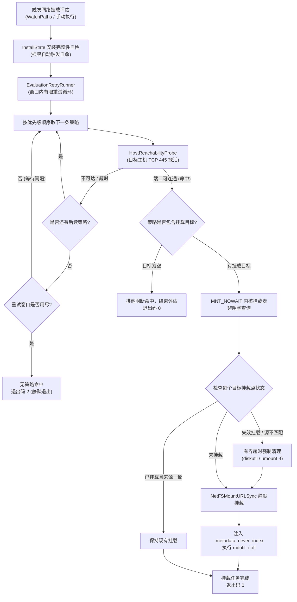

# 网络评估与挂载流程

automnt 依序评估配置中的网络策略管道，基于目标主机 TCP 445 可达性探测进行命中决策，并在匹配后执行 SMB 挂载状态核对与按需挂载：


```mermaid
flowchart TD
    Start["触发网络挂载评估\n(WatchPaths / 手动执行)"] --> HealthCheck["InstallState 安装完整性自检\n(损毁自动触发自愈)"]
    HealthCheck --> RetryLoop["EvaluationRetryRunner\n(窗口内有限重试循环)"]
    
    RetryLoop --> NextProfile["按优先级顺序取下一条策略"]
    NextProfile --> HostProbe["HostReachabilityProbe\n(目标主机 TCP 445 探活)"]
    
    HostProbe -- "不可达 / 超时" --> HasMoreProfiles{"是否还有后续策略?"}
    HasMoreProfiles -- "是" --> NextProfile
    HasMoreProfiles -- "否" --> WindowCheck{"重试窗口是否用尽?"}
    WindowCheck -- "否 (等待间隔)" --> NextProfile
    WindowCheck -- "是" --> ExitSilent["无策略命中\n退出码 2 (静默退出)"]
    
    HostProbe -- "端口可连通 (命中)" --> HasTargets{"策略是否包含挂载目标?"}
    HasTargets -- "目标为空" --> ExitSuccess["排他阻断命中，结束评估\n退出码 0"]
    HasTargets -- "有挂载目标" --> KernelScan["MNT_NOWAIT 内核挂载表非阻塞查询"]
    
    KernelScan --> TargetAudit{"检查每个目标挂载点状态"}
    TargetAudit -- "已挂载且来源一致" --> KeepMount["保持现有挂载"]
    TargetAudit -- "失效挂载 / 源不匹配" --> BoundedClean["有界超时强制清理\n(diskutil / umount -f)"]
    BoundedClean --> DoMount["NetFSMountURLSync 静默挂载"]
    TargetAudit -- "未挂载" --> DoMount
    
    DoMount --> SpotlightShield["注入 .metadata_never_index\n执行 mdutil -i off"]
    SpotlightShield --> Finish["挂载任务完成\n退出码 0"]
    KeepMount --> Finish
```

# 支持平台与核心原则

automnt 专为 Apple silicon（arm64）设备与 macOS 27.0 或更高版本设计。不支持 Intel（x86_64）Mac 与 macOS 27.0 之前的系统版本。

- **确定性选型**：调用 macOS 原生 `NetFSMountURLSync` 框架，使用系统钥匙串免密挂载，绝不弹窗打扰用户。
- **服务可达性优先**：彻底弃用脆弱的链路层 ARP / 网关 MAC 嗅探，全面转向传输层主机服务探测（`HostReachabilityProbe`），天然兼容多网卡、Tailscale、WireGuard 及复杂 VLAN 环境。
- **纯事件驱动无轮询**：LaunchAgent 仅监听系统网络变化与登录事件，严格杜绝 `StartInterval` 定时器空转。
- **单一活动配置契约**：全系统严格归一于 `~/Library/Application Support/automnt/automnt.plist`，使用 `0600` 权限安全管理。

# 核心系统机制

## 主机服务可达性探测 (HostReachabilityProbe)

在网络评估阶段，automnt 通过标准的 BSD Socket 向指定主机的目标端口（默认 445）发起非阻塞连接探测：

```swift
struct HostReachabilityProbe {
    static func canConnect(host: String, port: Int = 445, timeoutMs: Int = 1000) -> Bool
}
```

- 探测超时通常设为 500 ~ 1000 毫秒，避免长时间阻塞。
- 连接建立成功立即判定该网络策略命中并终止后续策略探测。
- 连接拒绝（RST）、路由不可达（ENETUNREACH / EHOSTUNREACH）或超时均视为未命中。

## 事件驱动与重试调度 (EvaluationRetryRunner)

由于网络连接、Wi-Fi 关联或 VPN 隧道建立往往存在数秒握手延迟，LaunchAgent 被系统网络变更事件唤醒后，不会因首次未就绪立即退出，而是通过有限重试执行器在安全时间窗口内运行：

```swift
struct EvaluationRetryRunner {
    let policy: RetryPolicy
    func run<T>(_ work: () -> T?) -> T?
}
```

- 默认配置：最大尝试 3 次，每次间隔 1000 毫秒，最大总窗口 10000 毫秒。
- 一旦某条策略探测成功，立即返回并执行挂载。
- 若窗口用尽仍未命中任何网络，返回退出码 `2`，通知 launchd 本次事件已处理且无需采取异常动作。

## 内核挂载表非阻塞查询

严禁使用 POSIX `stat()` 或 Foundation `FileManager` 检查可能已失联的挂载目录。automnt 采用 Darwin 原生 `getfsstat` 搭配 `MNT_NOWAIT` 标志位：

```swift
func queryActiveKernelMounts() -> [ActiveMountRecord] {
    let count = getfsstat(nil, 0, MNT_NOWAIT)
    guard count > 0 else { return [] }
    var buffer = [statfs](repeating: statfs(), count: Int(count))
    let actualCount = buffer.withUnsafeMutableBufferPointer { ptr in
        getfsstat(ptr.baseAddress, count * Int32(MemoryLayout<statfs>.size), MNT_NOWAIT)
    }
    // 从 buffer 读取挂载路径与源地址
}
```

此调用直接从内核 VFS 挂载快照返回数据，无论底层网络是否中断，均在数微秒内完成，杜绝进程假死与系统彩虹球。

## 失效挂载的有界超时清理

当检测到挂载点被陈旧的失效连接占用，或当前策略需要切换到不同来源时，automnt 按照两级有限超时子进程执行清理：
1. 优先调用 `diskutil unmount force <path>`；
2. 若超时或失败，降级调用 `umount -f <path>`；
3. 全过程受到最大超时窗口严格约束，前序子进程未安全退出前绝不启动并发卸载，确保文件系统卸载动作的确定性。

## Spotlight 检索防护

挂载成功后，automnt 立即执行两级索引防护：
1. 执行 `/usr/bin/mdutil -i off <mountPath>`，请求系统元数据服务停用索引；
2. 在共享卷宗根目录创建 `.metadata_never_index` 文件，防止后续系统服务自动重建索引。

## 免编译预编译自升级与自愈

- **预编译分发**：自升级直接拉取 GitHub Release 中的 `automnt` 二进制包，绕过终端用户的本地编译环境需求。
- **原子部署与校验**：新程序下载后在临时目录执行 `--version` 语法自检，验证成功后通过文件系统原子替换安装到 `~/Library/Application Support/automnt/bin/automnt`。
- **安装状态自愈**：主程序启动时由 `InstallState` 执行自检。若发现 LaunchAgent 缺失、Shell 环境变量丢失或文件损坏，自动原地修复。
